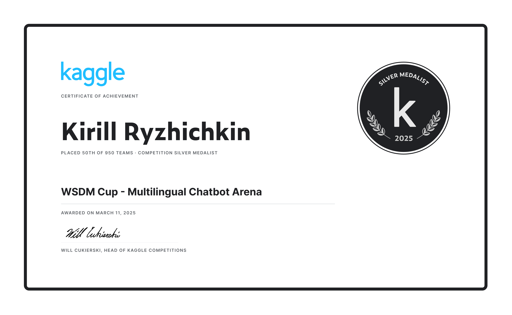

# WSDM Cup - Multilingual Chatbot Arena (Kaggle Silver Medal)

## Описание

> В этом соревновании нам предстояло предсказать, какие ответы предпочтут пользователи в битве лицом к лицу между чат-ботами, работающими на базе large language models (LLM). Нам был предоставлен набор данных о разговорах с чат-ботами, где разные LLM генерируют ответы на запросы пользователей. Разработав выигрышную модель машинного обучения, мы помогли улучшить взаимодействие чат-ботов с людьми и добиться того, чтобы они лучше соответствовали человеческим предпочтениям.

## Этап 1 (Выбор модели + квантование)

В качестве базовой модели была использована 8-битная квантизированная модель `google/gemma-2-9 бит` из топ-5 решений LMSYS, конфигурация:

```python
cfg = {
    "_load_in_4bit": False,
    "_load_in_8bit": True,
    "bnb_4bit_compute_dtype": "bfloat16",
    "bnb_4bit_quant_storage": "uint8",
    "bnb_4bit_quant_type": "fp4",
    "bnb_4bit_use_double_quant": False,
    "llm_int8_enable_fp32_cpu_offload": False,
    "llm_int8_has_fp16_weight": False,
    "llm_int8_skip_modules": None,
    "llm_int8_threshold": 6.0,
    "load_in_4bit": False,
    "load_in_8bit": True,
    "quant_method": "bitsandbytes"
}
```

Мы также попробовали `Qwen/Qwen2.5-7B-Instruct`, `deepseek-ai/DeepSeek-R1-Distill-Qwen-7B`, `sfairXC/FsfairX-Gemma2-RM-v0.1`, а также попытались использовать свою модель из LMSYS в качестве базовой модели, однако это не помогло. все это давало худшие результаты.

### Code

Вы можете ознакомиться с нашим блокнотом для квантования [здесь](https://github.com/l1ghtsource/wsdm-cup-2024/blob/main/quantize/base-quantize.ipynb).

## Этап 2 (Обучение + Pseudo labeling)

### Данные

Мы перепробовал множество наборов данных:

- ultrafeedback
- 33k extra from lmsys
- lmsys dataset
- orpo 44k
- pseudolabels from top-3 lmsys team
- public wsdm extra data

Однако, поскольку мы обучались через контрольную точку из LMSYS, модель уже видела данные из LMSYS, 33k, ORPO, Ultrafeedback, и добавление их в набор данных train не улучшило результат.
Мы также сгенерировали 600000 [pseudolabels](https://github.com/l1ghtsource/wsdm-cup-2024/blob/main/train/pseudolabel.ipynb), однако добавление их в качестве дополнительных меток в набор данных train также не помогло.
Таким образом, в качестве набора данных мы использовали только данные из WSDM.

### Наша конфигурация

- 8bit qlora
- truncation_side='leftside'
- padding_side='leftside'
- max_length=2200
- batch_size=8
- lr=2e-4
- warmup_ratio=0.025
- lora_r=64
- lora_alpha=4
- lora_dropout=0.05
- target_modules=('q_proj', 'k_proj', 'v_proj', 'o_proj', 'gate_proj', 'up_proj', 'down_proj')
- head_dropout=0.1
- label_smoothing_alpha=0.0
- bf16 compute dtype
- custom head

### Кастомная голова

```python
model.score = torch.nn.Sequential(
    torch.nn.Dropout(config.head_dropout),
    torch.nn.Linear(config.hdim, config.hdim // 2),
    torch.nn.Dropout(config.head_dropout),
    torch.nn.GELU(),
    torch.nn.Linear(config.hdim // 2, config.num_labels),
).cuda().bfloat16()
```

### Code

Вы можете ознакомиться с нашим блокнотом [здесь](https://github.com/l1ghtsource/wsdm-cup-2024/blob/main/train/train-notebook.ipynb).

## Этап 3 (Инференс)

На инференсе мы использовали 2 модели - одна была обучена на тройках (prompt, answer_a, answer_b), а другая - на (prompt, answer_b, answer_a). Мы также выводили их на обычных и инвертированных тройках.

### Code

Вы можете ознакомиться с нашим блокнотом для инференса [здесь](https://github.com/l1ghtsource/wsdm-cup-2024/blob/main/inference/wsdm-inference-2-models.ipynb).

## Certificate


